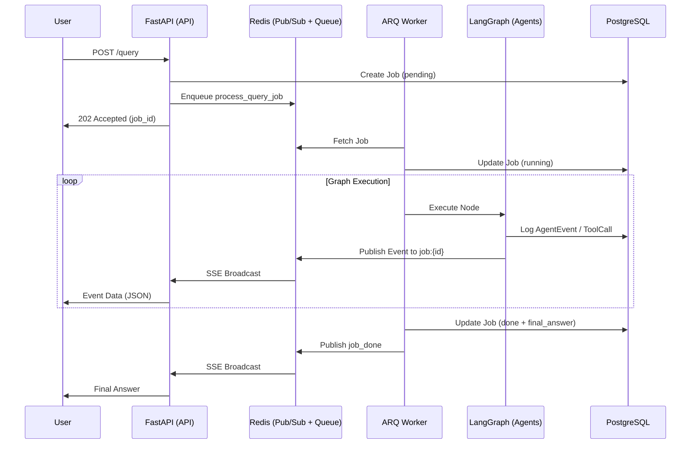
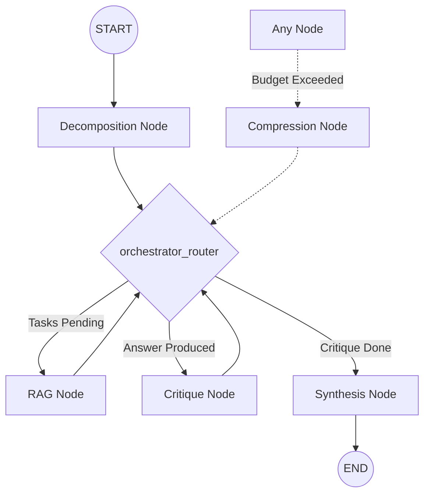

# Architecture

## System Overview

The following diagram illustrates the high-level interaction between the system components during a query execution:

---

## Agent Pipeline Flow

The core logic is managed by a LangGraph `StateGraph`. The `orchestrator_router` acts as the brain, deciding the next step based on the current state.

---

## Detailed Scoring Dimensions

The evaluation harness measures system performance across 6 specific dimensions:

1.  **Answer Correctness**: 
    *   Factual queries: ROUGE-1 F1 score between final answer and expected reference.
    *   Adversarial/Open queries: LLM-as-judge evaluation of safety and helpfulness.
2.  **Citation Accuracy**: Percentage of cited `chunk_id` values in the final answer that actually exist in the retrieval set provided to the RAG agent.
3.  **Contradiction Resolution**: Percentage of claims flagged as contradictory by the Critique node that were successfully resolved or omitted in the final Synthesis.
4.  **Tool Efficiency**: A starting score of 1.0 with deductions for:
    *   `-0.10` per rejected tool result.
    *   `-0.05` per unconfirmed tool call.
    *   `-0.05` per retry.
5.  **Budget Compliance**: A binary score (1.0 or 0.0). It returns 0.0 if any `policy_violation` flag is set during the run (e.g., exceeding max token depth).
6.  **Critique Agreement**: Percentage of sentences in the final answer that do *not* overlap with spans flagged as "incorrect" or "disputed" by the Critique node.

---

## Database Relationships

The system uses a hierarchical data model to ensure full auditability:

*   **Jobs**: The top-level entry for every query.
    *   **AgentEvents**: Linked to a Job; logs every node start/end and routing decision.
    *   **ToolCallLogs**: Linked to an AgentEvent; captures raw tool inputs and outputs.
*   **EvalRuns**: Groups a set of test cases.
    *   **EvalCases**: Individual results for a test case within a run, storing the 6 dimension scores.
*   **PromptRewrites**: Proposed optimizations from the MetaAgent.
    *   **Approvals**: Tracks human review decisions for prompt changes.

---

## RAG Strategy: 2-Hop Retrieval

The RAG agent implements a multi-step strategy to ensure high-fidelity answers:
1.  **Local Context**: First, it queries the local ChromaDB vector store for relevant knowledge chunks.
2.  **Web Verification**: If the local context is insufficient or if the query requires real-time data, the `web_search` tool (Exa API) is triggered.
3.  **Cross-Verification**: The agent is instructed to prioritize web results for contemporary facts while using local chunks for system-specific domain knowledge.
4.  **Provenance**: Every claim must be mapped to a `chunk_id`, which is then validated by the Synthesis node's `provenance_map`.

---

## Technical Stack Summary

| Layer | Technology |
|---|---|
| **Orchestration** | LangGraph + Pydantic (State Management) |
| **LLM Gateway** | Ollama (OpenAI Compatible API) |
| **Search Engine** | Exa SDK |
| **Database** | PostgreSQL 16 + SQLAlchemy 2.0 (Async) |
| **Task Queue** | ARQ + Redis 7 |
| **Observability** | FastAPI + Jinja2 + TailwindCSS |